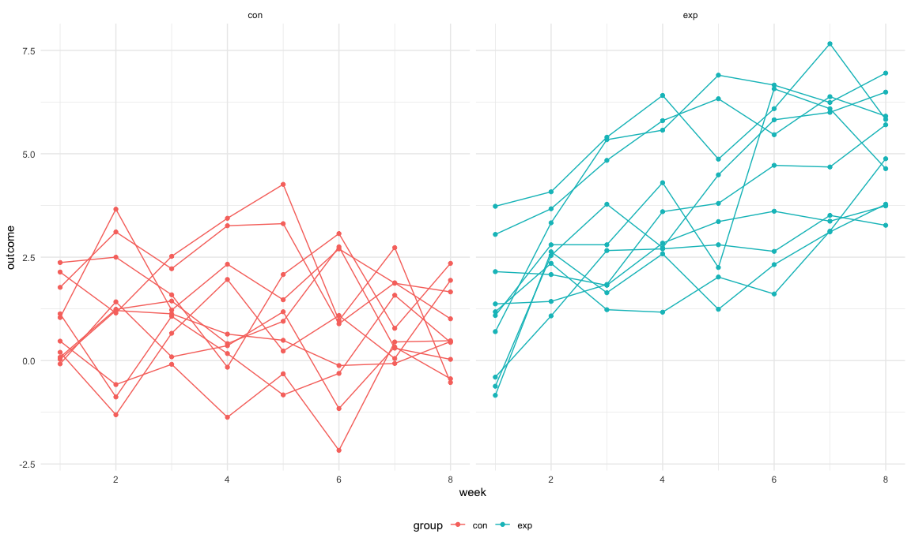
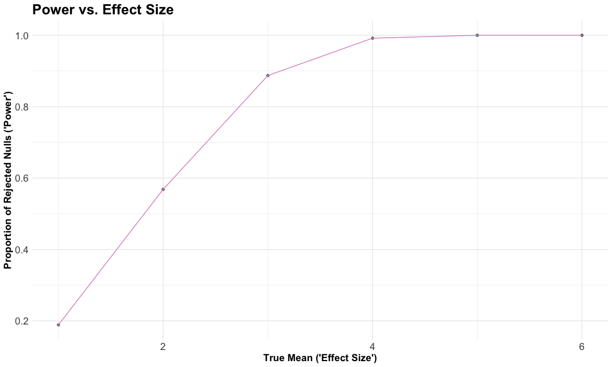
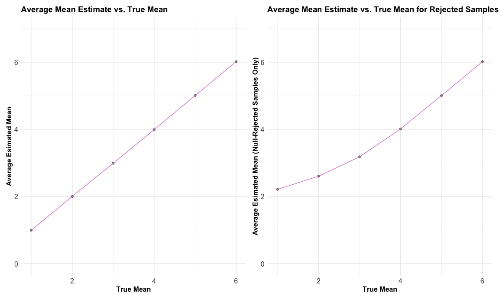

p8105_hw5_amz2148
================

Data Science: Homework 5

# Problem 0

``` r
library(tidyverse) #loads tidyverse package
```

    ## ── Attaching packages ─────────────────────────────────────── tidyverse 1.3.2 ──
    ## ✔ ggplot2 3.4.0      ✔ purrr   0.3.5 
    ## ✔ tibble  3.1.8      ✔ dplyr   1.0.10
    ## ✔ tidyr   1.2.0      ✔ stringr 1.4.1 
    ## ✔ readr   2.1.3      ✔ forcats 0.5.2 
    ## ── Conflicts ────────────────────────────────────────── tidyverse_conflicts() ──
    ## ✖ dplyr::filter() masks stats::filter()
    ## ✖ dplyr::lag()    masks stats::lag()

``` r
library(purrr) #loads purrr package
library(patchwork) #loads patchwork package
set.seed(1) #sets seed for reproducibility 
```

``` r
knitr::opts_chunk$set(echo = TRUE) #shows all code chunks
knitr::opts_chunk$set(
  fig.width = 12,
  fig.asp = .6,
  out.width = "100%") #sets figure dimensions

theme_set(theme_minimal() + theme(legend.position = "bottom")) #sets default figure theme
```

# Problem 1

Code fixed with provided answer key.

First, we create a dataframe with all the file names from the `zip_data`
folder. Then we iterate over file names and read in data for each
subject using `purrr::map` and saving the result as a new variable in
the dataframe.

``` r
full_df = 
  tibble(
    files = list.files("data/zip_data/"),
    path = str_c("data/zip_data/", files)
  ) %>% 
  mutate(data = map(path, read_csv)) %>% 
  unnest()
```

    ## Rows: 1 Columns: 8
    ## ── Column specification ────────────────────────────────────────────────────────
    ## Delimiter: ","
    ## dbl (8): week_1, week_2, week_3, week_4, week_5, week_6, week_7, week_8
    ## 
    ## ℹ Use `spec()` to retrieve the full column specification for this data.
    ## ℹ Specify the column types or set `show_col_types = FALSE` to quiet this message.
    ## Rows: 1 Columns: 8
    ## ── Column specification ────────────────────────────────────────────────────────
    ## Delimiter: ","
    ## dbl (8): week_1, week_2, week_3, week_4, week_5, week_6, week_7, week_8
    ## 
    ## ℹ Use `spec()` to retrieve the full column specification for this data.
    ## ℹ Specify the column types or set `show_col_types = FALSE` to quiet this message.
    ## Rows: 1 Columns: 8
    ## ── Column specification ────────────────────────────────────────────────────────
    ## Delimiter: ","
    ## dbl (8): week_1, week_2, week_3, week_4, week_5, week_6, week_7, week_8
    ## 
    ## ℹ Use `spec()` to retrieve the full column specification for this data.
    ## ℹ Specify the column types or set `show_col_types = FALSE` to quiet this message.
    ## Rows: 1 Columns: 8
    ## ── Column specification ────────────────────────────────────────────────────────
    ## Delimiter: ","
    ## dbl (8): week_1, week_2, week_3, week_4, week_5, week_6, week_7, week_8
    ## 
    ## ℹ Use `spec()` to retrieve the full column specification for this data.
    ## ℹ Specify the column types or set `show_col_types = FALSE` to quiet this message.
    ## Rows: 1 Columns: 8
    ## ── Column specification ────────────────────────────────────────────────────────
    ## Delimiter: ","
    ## dbl (8): week_1, week_2, week_3, week_4, week_5, week_6, week_7, week_8
    ## 
    ## ℹ Use `spec()` to retrieve the full column specification for this data.
    ## ℹ Specify the column types or set `show_col_types = FALSE` to quiet this message.
    ## Rows: 1 Columns: 8
    ## ── Column specification ────────────────────────────────────────────────────────
    ## Delimiter: ","
    ## dbl (8): week_1, week_2, week_3, week_4, week_5, week_6, week_7, week_8
    ## 
    ## ℹ Use `spec()` to retrieve the full column specification for this data.
    ## ℹ Specify the column types or set `show_col_types = FALSE` to quiet this message.
    ## Rows: 1 Columns: 8
    ## ── Column specification ────────────────────────────────────────────────────────
    ## Delimiter: ","
    ## dbl (8): week_1, week_2, week_3, week_4, week_5, week_6, week_7, week_8
    ## 
    ## ℹ Use `spec()` to retrieve the full column specification for this data.
    ## ℹ Specify the column types or set `show_col_types = FALSE` to quiet this message.
    ## Rows: 1 Columns: 8
    ## ── Column specification ────────────────────────────────────────────────────────
    ## Delimiter: ","
    ## dbl (8): week_1, week_2, week_3, week_4, week_5, week_6, week_7, week_8
    ## 
    ## ℹ Use `spec()` to retrieve the full column specification for this data.
    ## ℹ Specify the column types or set `show_col_types = FALSE` to quiet this message.
    ## Rows: 1 Columns: 8
    ## ── Column specification ────────────────────────────────────────────────────────
    ## Delimiter: ","
    ## dbl (8): week_1, week_2, week_3, week_4, week_5, week_6, week_7, week_8
    ## 
    ## ℹ Use `spec()` to retrieve the full column specification for this data.
    ## ℹ Specify the column types or set `show_col_types = FALSE` to quiet this message.
    ## Rows: 1 Columns: 8
    ## ── Column specification ────────────────────────────────────────────────────────
    ## Delimiter: ","
    ## dbl (8): week_1, week_2, week_3, week_4, week_5, week_6, week_7, week_8
    ## 
    ## ℹ Use `spec()` to retrieve the full column specification for this data.
    ## ℹ Specify the column types or set `show_col_types = FALSE` to quiet this message.
    ## Rows: 1 Columns: 8
    ## ── Column specification ────────────────────────────────────────────────────────
    ## Delimiter: ","
    ## dbl (8): week_1, week_2, week_3, week_4, week_5, week_6, week_7, week_8
    ## 
    ## ℹ Use `spec()` to retrieve the full column specification for this data.
    ## ℹ Specify the column types or set `show_col_types = FALSE` to quiet this message.
    ## Rows: 1 Columns: 8
    ## ── Column specification ────────────────────────────────────────────────────────
    ## Delimiter: ","
    ## dbl (8): week_1, week_2, week_3, week_4, week_5, week_6, week_7, week_8
    ## 
    ## ℹ Use `spec()` to retrieve the full column specification for this data.
    ## ℹ Specify the column types or set `show_col_types = FALSE` to quiet this message.
    ## Rows: 1 Columns: 8
    ## ── Column specification ────────────────────────────────────────────────────────
    ## Delimiter: ","
    ## dbl (8): week_1, week_2, week_3, week_4, week_5, week_6, week_7, week_8
    ## 
    ## ℹ Use `spec()` to retrieve the full column specification for this data.
    ## ℹ Specify the column types or set `show_col_types = FALSE` to quiet this message.
    ## Rows: 1 Columns: 8
    ## ── Column specification ────────────────────────────────────────────────────────
    ## Delimiter: ","
    ## dbl (8): week_1, week_2, week_3, week_4, week_5, week_6, week_7, week_8
    ## 
    ## ℹ Use `spec()` to retrieve the full column specification for this data.
    ## ℹ Specify the column types or set `show_col_types = FALSE` to quiet this message.
    ## Rows: 1 Columns: 8
    ## ── Column specification ────────────────────────────────────────────────────────
    ## Delimiter: ","
    ## dbl (8): week_1, week_2, week_3, week_4, week_5, week_6, week_7, week_8
    ## 
    ## ℹ Use `spec()` to retrieve the full column specification for this data.
    ## ℹ Specify the column types or set `show_col_types = FALSE` to quiet this message.
    ## Rows: 1 Columns: 8
    ## ── Column specification ────────────────────────────────────────────────────────
    ## Delimiter: ","
    ## dbl (8): week_1, week_2, week_3, week_4, week_5, week_6, week_7, week_8
    ## 
    ## ℹ Use `spec()` to retrieve the full column specification for this data.
    ## ℹ Specify the column types or set `show_col_types = FALSE` to quiet this message.
    ## Rows: 1 Columns: 8
    ## ── Column specification ────────────────────────────────────────────────────────
    ## Delimiter: ","
    ## dbl (8): week_1, week_2, week_3, week_4, week_5, week_6, week_7, week_8
    ## 
    ## ℹ Use `spec()` to retrieve the full column specification for this data.
    ## ℹ Specify the column types or set `show_col_types = FALSE` to quiet this message.
    ## Rows: 1 Columns: 8
    ## ── Column specification ────────────────────────────────────────────────────────
    ## Delimiter: ","
    ## dbl (8): week_1, week_2, week_3, week_4, week_5, week_6, week_7, week_8
    ## 
    ## ℹ Use `spec()` to retrieve the full column specification for this data.
    ## ℹ Specify the column types or set `show_col_types = FALSE` to quiet this message.
    ## Rows: 1 Columns: 8
    ## ── Column specification ────────────────────────────────────────────────────────
    ## Delimiter: ","
    ## dbl (8): week_1, week_2, week_3, week_4, week_5, week_6, week_7, week_8
    ## 
    ## ℹ Use `spec()` to retrieve the full column specification for this data.
    ## ℹ Specify the column types or set `show_col_types = FALSE` to quiet this message.
    ## Rows: 1 Columns: 8
    ## ── Column specification ────────────────────────────────────────────────────────
    ## Delimiter: ","
    ## dbl (8): week_1, week_2, week_3, week_4, week_5, week_6, week_7, week_8
    ## 
    ## ℹ Use `spec()` to retrieve the full column specification for this data.
    ## ℹ Specify the column types or set `show_col_types = FALSE` to quiet this message.

    ## Warning: `cols` is now required when using unnest().
    ## Please use `cols = c(data)`

We then tidy the result (manipulate file names to include control arm
and subject ID, make sure weekly observations are “tidy”, and do any
other tidying that’s necessary).

``` r
tidy_df = 
  full_df %>% 
  mutate(
    files = str_replace(files, ".csv", ""),
    group = str_sub(files, 1, 3)) %>% 
  pivot_longer(
    week_1:week_8,
    names_to = "week",
    values_to = "outcome",
    names_prefix = "week_") %>% 
  mutate(week = as.numeric(week)) %>% 
  select(group, subj = files, week, outcome)
```

Finally, we make a spaghetti plot showing observations on each subject
over time.

``` r
tidy_df %>% 
  ggplot(aes(x = week, y = outcome, group = subj, color = group)) + 
  geom_point() + 
  geom_path() + 
  facet_grid(~group)
```



The two plots show there is much variation even within individuals’.
Individuals’ values change over time, sometimes increasing, then
decreasing, and increasing again, etc. The control individuals’ appear
to remain at roughly the same outcome level from start to end, however,
while the experimental individuals increase over time with regard to the
outcome.

# Problem 2

First, we load the CSV file of homicide data from Washington Past, clean
the variable names, change unknown values to NA for consistency (since
some but not all variables already have missing/unknown values already
coded as NA), and describe the dataset.

``` r
homicides = 
  read_csv("data/homicide_data.csv") %>% #loads csv file
  janitor::clean_names() %>% #cleans variable names
  gdata::unknownToNA("Unknown", warning = FALSE) #changes all "unknown" values to "NA"
```

    ## Rows: 52179 Columns: 12
    ## ── Column specification ────────────────────────────────────────────────────────
    ## Delimiter: ","
    ## chr (9): uid, victim_last, victim_first, victim_race, victim_age, victim_sex...
    ## dbl (3): reported_date, lat, lon
    ## 
    ## ℹ Use `spec()` to retrieve the full column specification for this data.
    ## ℹ Specify the column types or set `show_col_types = FALSE` to quiet this message.

In the resulting dataset, there are `52179` rows (observations) and `12`
columns (variables). The variables’ names are
`uid, reported_date, victim_last, victim_first, victim_race, victim_age, victim_sex, city, state, lat, lon, disposition`.
We see that `uid` provides the victim’s ID (with a prefix for the city
followed by an identifying number), `reported_date` gives the date on
which the homicide was reported (YYYYMMDD), `victim_last` gives the
victim’s last name, `victim_first` gives the victim’s first name,
`victim_race` gives the victim’s race (Asian, Black, Hispanic, Other,
White), `victim_age` gives the victim’s age in years, `victim_sex` gives
the victim’s sex (male, female), `city`, `state`, `lat` (latitude), and
`long` (longitude) give the location of the homicide, and `disposition`
gives the outcome of the case (closed by arrest, closed without arrest,
open/no arrest).

Next, we create a `city_state` variable (e.g. “Baltimore, MD”) and then
summarize within cities to obtain the total number of homicides and the
number of unsolved homicides (those for which the disposition is “Closed
without arrest” or “Open/No arrest”). The table showing this data is
below the associated code. We also recode certain observations that are
obviously errors (e.g., wI should be WI, Tulsa, AL should be Tulsa, OK)
using the mutate and replace functions.

``` r
homicides = 
  homicides %>% 
  mutate(state = replace(state, state == "AL", "OK")) %>% #fixes values erroneously labeled AL
  mutate(state = replace(state, state == "wI", "WI")) %>% #fixes values erroneously labeled wI
  mutate(city_state = paste(city, state, sep = ", ")) %>% #creates city_state variable
  group_by(city_state) %>% #groups by city_state
  summarize(n_unsolved = sum(disposition == 'Closed without arrest' | disposition == 'Open/No arrest'), n_total = n()) #creates new variables for total homicides and total unsolved homicides

homicides_table = 
  homicides %>% 
  knitr::kable(digits = 4) #creates table

homicides_table #outputs table
```

| city_state         | n_unsolved | n_total |
|:-------------------|-----------:|--------:|
| Albuquerque, NM    |        146 |     378 |
| Atlanta, GA        |        373 |     973 |
| Baltimore, MD      |       1825 |    2827 |
| Baton Rouge, LA    |        196 |     424 |
| Birmingham, OK     |        347 |     800 |
| Boston, MA         |        310 |     614 |
| Buffalo, NY        |        319 |     521 |
| Charlotte, NC      |        206 |     687 |
| Chicago, IL        |       4073 |    5535 |
| Cincinnati, OH     |        309 |     694 |
| Columbus, OH       |        575 |    1084 |
| Dallas, TX         |        754 |    1567 |
| Denver, CO         |        169 |     312 |
| Detroit, MI        |       1482 |    2519 |
| Durham, NC         |        101 |     276 |
| Fort Worth, TX     |        255 |     549 |
| Fresno, CA         |        169 |     487 |
| Houston, TX        |       1493 |    2942 |
| Indianapolis, IN   |        594 |    1322 |
| Jacksonville, FL   |        597 |    1168 |
| Kansas City, MO    |        486 |    1190 |
| Las Vegas, NV      |        572 |    1381 |
| Long Beach, CA     |        156 |     378 |
| Los Angeles, CA    |       1106 |    2257 |
| Louisville, KY     |        261 |     576 |
| Memphis, TN        |        483 |    1514 |
| Miami, FL          |        450 |     744 |
| Milwaukee, WI      |        403 |    1115 |
| Minneapolis, MN    |        187 |     366 |
| Nashville, TN      |        278 |     767 |
| New Orleans, LA    |        930 |    1434 |
| New York, NY       |        243 |     627 |
| Oakland, CA        |        508 |     947 |
| Oklahoma City, OK  |        326 |     672 |
| Omaha, NE          |        169 |     409 |
| Philadelphia, PA   |       1360 |    3037 |
| Phoenix, AZ        |        504 |     914 |
| Pittsburgh, PA     |        337 |     631 |
| Richmond, VA       |        113 |     429 |
| Sacramento, CA     |        139 |     376 |
| San Antonio, TX    |        357 |     833 |
| San Bernardino, CA |        170 |     275 |
| San Diego, CA      |        175 |     461 |
| San Francisco, CA  |        336 |     663 |
| Savannah, GA       |        115 |     246 |
| St. Louis, MO      |        905 |    1677 |
| Stockton, CA       |        266 |     444 |
| Tampa, FL          |         95 |     208 |
| Tulsa, OK          |        193 |     584 |
| Washington, DC     |        589 |    1345 |

For the city of Baltimore, MD, we use the `prop.test` function to
estimate the proportion of homicides that are unsolved; save the output
of `prop.test` as an R object, apply the `broom::tidy` to this object
and pull the estimated proportion and 95% confidence interval from the
resulting tidy dataframe.

``` r
baltimore_md = 
  homicides %>% 
  filter(city_state == "Baltimore, MD") #only includes observations from Baltimore, MD

x = baltimore_md %>% pull(n_unsolved) #number of "success" trials
n = baltimore_md %>% pull(n_total) #number of total trials

baltimore_test = 
  prop.test(x, n, p = NULL, 
          alternative = c("two.sided", "less", "greater"), 
          conf.level = 0.95, correct = TRUE) %>% #runs a 1 sample test of proportions, two-sided, 0.05 level of significance
  broom::tidy() %>% #tidies prop.test output
  janitor::clean_names() #cleans variable names 
    
baltimore_table = 
  baltimore_test %>% 
  select(estimate, starts_with("conf")) %>% #pulls proportion of unsolved homicides and CIs for each city
  knitr::kable(digits = 4) #creates table

baltimore_table #outputs table
```

| estimate | conf_low | conf_high |
|---------:|---------:|----------:|
|   0.6456 |   0.6276 |    0.6632 |

We see that 64.56% of homicides in Baltimore, MD from this sample are
unsolved. We are 95% confident that the true proportion of unsolved
homicides in Baltimore, MD lies between 52.76% and 66.32%.

Now we run `prop.test` for each of the cities in the dataset and extract
both the proportion of unsolved homicides and confidence intervals for
each.

``` r
all_cities = 
  homicides %>%
  mutate(test = map2(n_unsolved, n_total, ~ prop.test(.x, .y, conf.level=0.95) %>% #runs 1 sample test of proportions (0.05 level of significance) on each city
  broom::tidy())) %>% #tidies prop.test output
  unnest(test) %>% #unnests resulting dataframe
  janitor::clean_names() %>% #cleans variable names
  select(city_state, estimate, conf_low, conf_high) %>% #extracts only certain variables (location name, proportion of unsolved homicides, CI)
  mutate(city_state = as.factor(city_state)) #converts city_state variable to a factor

all_cities_table = 
  all_cities %>%
  knitr::kable(digits = 4) #creates table

all_cities_table #outputs table
```

| city_state         | estimate | conf_low | conf_high |
|:-------------------|---------:|---------:|----------:|
| Albuquerque, NM    |   0.3862 |   0.3373 |    0.4376 |
| Atlanta, GA        |   0.3834 |   0.3528 |    0.4148 |
| Baltimore, MD      |   0.6456 |   0.6276 |    0.6632 |
| Baton Rouge, LA    |   0.4623 |   0.4142 |    0.5110 |
| Birmingham, OK     |   0.4338 |   0.3992 |    0.4690 |
| Boston, MA         |   0.5049 |   0.4646 |    0.5451 |
| Buffalo, NY        |   0.6123 |   0.5688 |    0.6541 |
| Charlotte, NC      |   0.2999 |   0.2661 |    0.3359 |
| Chicago, IL        |   0.7359 |   0.7240 |    0.7474 |
| Cincinnati, OH     |   0.4452 |   0.4080 |    0.4831 |
| Columbus, OH       |   0.5304 |   0.5002 |    0.5605 |
| Dallas, TX         |   0.4812 |   0.4562 |    0.5062 |
| Denver, CO         |   0.5417 |   0.4846 |    0.5977 |
| Detroit, MI        |   0.5883 |   0.5688 |    0.6076 |
| Durham, NC         |   0.3659 |   0.3096 |    0.4261 |
| Fort Worth, TX     |   0.4645 |   0.4223 |    0.5072 |
| Fresno, CA         |   0.3470 |   0.3051 |    0.3914 |
| Houston, TX        |   0.5075 |   0.4892 |    0.5257 |
| Indianapolis, IN   |   0.4493 |   0.4223 |    0.4766 |
| Jacksonville, FL   |   0.5111 |   0.4820 |    0.5401 |
| Kansas City, MO    |   0.4084 |   0.3804 |    0.4370 |
| Las Vegas, NV      |   0.4142 |   0.3881 |    0.4407 |
| Long Beach, CA     |   0.4127 |   0.3629 |    0.4643 |
| Los Angeles, CA    |   0.4900 |   0.4692 |    0.5109 |
| Louisville, KY     |   0.4531 |   0.4121 |    0.4948 |
| Memphis, TN        |   0.3190 |   0.2957 |    0.3433 |
| Miami, FL          |   0.6048 |   0.5686 |    0.6400 |
| Milwaukee, WI      |   0.3614 |   0.3333 |    0.3905 |
| Minneapolis, MN    |   0.5109 |   0.4585 |    0.5631 |
| Nashville, TN      |   0.3625 |   0.3286 |    0.3977 |
| New Orleans, LA    |   0.6485 |   0.6231 |    0.6732 |
| New York, NY       |   0.3876 |   0.3494 |    0.4271 |
| Oakland, CA        |   0.5364 |   0.5041 |    0.5685 |
| Oklahoma City, OK  |   0.4851 |   0.4468 |    0.5236 |
| Omaha, NE          |   0.4132 |   0.3653 |    0.4627 |
| Philadelphia, PA   |   0.4478 |   0.4300 |    0.4657 |
| Phoenix, AZ        |   0.5514 |   0.5185 |    0.5839 |
| Pittsburgh, PA     |   0.5341 |   0.4943 |    0.5735 |
| Richmond, VA       |   0.2634 |   0.2229 |    0.3083 |
| Sacramento, CA     |   0.3697 |   0.3212 |    0.4209 |
| San Antonio, TX    |   0.4286 |   0.3948 |    0.4630 |
| San Bernardino, CA |   0.6182 |   0.5577 |    0.6753 |
| San Diego, CA      |   0.3796 |   0.3354 |    0.4258 |
| San Francisco, CA  |   0.5068 |   0.4681 |    0.5454 |
| Savannah, GA       |   0.4675 |   0.4041 |    0.5319 |
| St. Louis, MO      |   0.5397 |   0.5154 |    0.5637 |
| Stockton, CA       |   0.5991 |   0.5517 |    0.6447 |
| Tampa, FL          |   0.4567 |   0.3881 |    0.5270 |
| Tulsa, OK          |   0.3305 |   0.2927 |    0.3705 |
| Washington, DC     |   0.4379 |   0.4112 |    0.4649 |

Finally, we create a plot that shows the proportion of unsolved
homicides and CIs for each city, with error bars based on the upper and
lower limits. We organize cities according to the proportion of unsolved
homicides.

``` r
all_cities = 
  all_cities %>%
  mutate(city_state = reorder(city_state, -estimate)) #reorders city_state variables in descending proportion of unsolved homicides

ggplot(all_cities, aes( x = city_state, y = estimate)) + #creates ggplot of city_state vs. proportion of unsolved homicides
  geom_bar(stat = 'identity', alpha = 0.7, fill = "#d98fcc") + #creates bar-chart
  geom_errorbar(aes(ymin = conf_low, ymax = conf_high), alpha = 0.7) +  #adds error-bars
  theme(plot.title = element_text(size = 20, face = "bold")) + #edits title size
  theme(axis.text.x = element_text(angle = 90, vjust = 0.5, hjust = 1, size = 14)) + #edits appearance of x axis labels
  theme(axis.text.y = element_text(size = 14)) + #edits y axis label size
  theme(axis.title = element_text(size = 14, face = "bold")) + #edits axes title sizes
  theme(plot.caption = element_text(size = 12)) + #edits caption size
  labs(
      title = "Proportion of Unsolved Homicides in U.S. Cities with 95% Confidence Intervals",
      x = "City, State",
      y = "Proportion of Unsolved Homicides",
      caption = "Data from Washington Post.") #adds figure title, axes titles, and caption
```


As seen in the above bar-chart, Chicago, IL has the highest proportion
of unsolved homicides at over 73.59% (95% CI: 72.40% - 74.74%). Of the
sampled cities, Richmond, VA has the lowest proportion of unsolved
homicides at 26.34% (95% CI: 22.29% - 30.83%).

# Problem 3

In this problem, we will conduct a simulation to explore power in a
one-sample t-test. First, we set the following design elements:

-   Fix n=30
-   Fix σ=5
-   Set μ=0.

Then, we generate 5000 datasets from the model x∼Normal\[μ,σ\]. For each
dataset, we save mu-hat (estimated mean) and the p-value arising from a
test of H: mu (true mean) = 0 and alpha = 0.05. To obtain the estimate
and p-value, we use `broom::tidy` to clean the output of `t.test`.

``` r
sim_t_test = function(mean, n = 30, sd = 5){

sample = rnorm(mean, n = 30, sd = 5) #normal sample with sample size of 30, standard deviation of 5

test_results = t.test(sample) #runs t-test on normal sample

test_results %>% 
  broom::tidy() #tidies t-test output into dataframe
}

sim_results_df = 
  expand_grid(
    true_mean = 0, #sets true mean to equal 0
    iter = 1:5000 #sets number of t-tests to be run at 5000
  ) %>% 
  mutate(
    estimate_df = map(true_mean, sim_t_test) #applies sim_t_test function created above with true_mean variable specified above
  ) %>% 
  unnest(estimate_df) %>% #unnests resulting dataframe
  janitor::clean_names() #cleans variable names

sim_results_df = 
  sim_results_df %>%
  select(true_mean, estimate, p_value) #keeps only true mean value (mu), estimated mean (mu-hat), and p-value for each t-test

head(sim_results_df) #displays first few rows of dataframe
```

    ## # A tibble: 6 × 3
    ##   true_mean estimate p_value
    ##       <dbl>    <dbl>   <dbl>
    ## 1         0    0.412  0.629 
    ## 2         0    0.664  0.368 
    ## 3         0    0.551  0.534 
    ## 4         0    0.567  0.487 
    ## 5         0   -1.65   0.0599
    ## 6         0    1.19   0.229

Above, we can see the first few rows of the resulting dataframe/tibble
where the `true_mean` (mu) is always fixed at 0, but we have `estimate`s
(mu-hats) for each row/t-test that was run along with `p-value`s. As
expected, our resulting dataframe has `5000` rows (observations)
representing the 5000 normal samples across which we ran t-tests.

Next, we repeat the above for true mean (mu) values of 1, 2, 3, 4, 5,
and 6.

``` r
iter_t_test = function(mean, n = 30, sd = 5){

sample = rnorm(mean, n = 30, sd = 5) #normal sample with sample size of 30, standard deviation of 5

test_results = t.test(sample) #runs t-test on normal sample

test_results %>% 
  broom::tidy() #tidies t-test result into dataframe
}

iter_results_df = 
  expand_grid(
    true_mean = c(1, 2, 3, 4, 5, 6), #sets true mean at various values
    iter = 1:5000 #sets number of t-tests per each true mean at 5000
  ) %>% 
  mutate(
    estimate_df = map(true_mean, iter_t_test) #applies iter_t_test function created above with the specific true_mean values specified above 
  ) %>% 
  unnest(estimate_df) %>% #unnests resulting dataframe
  janitor::clean_names() #cleans variable names

iter_results_df = 
  iter_results_df %>%
  select(true_mean, estimate, p_value) #keeps only true mean, estimated mean, and p-value variables for each row/sample

head(iter_results_df) #outputs first few rows of resulting dataframe
```

    ## # A tibble: 6 × 3
    ##   true_mean estimate p_value
    ##       <dbl>    <dbl>   <dbl>
    ## 1         1    1.52   0.0865
    ## 2         1    2.11   0.0159
    ## 3         1    2.01   0.0183
    ## 4         1    0.165  0.839 
    ## 5         1    0.108  0.912 
    ## 6         1    1.56   0.0682

As seen above, the resulting dataframe/tibble has `30000` rows
(observations) representing the 6\*5000 normal samples across which we
ran t-tests (5000 for each of the 6 values of mu). For each t-test, we
have an associated `true_mean` (mu) as well as a resulting `estimate`
(mu-hat), and `p-value`.

Now, we make a plot showing the proportion of times the null was
rejected (the power of the test) on the y axis and the true value of mu
(representing effect size, which is the difference from the true mean
and the null-hypothesis mean of 0) on the x axis.

``` r
iter_results_plot = 
  iter_results_df %>% 
  group_by(true_mean) %>% #groups by true_mean
  summarize(prop_reject = ((sum(p_value <= 0.05)) / n())) %>% #calculates proportion of times null was rejected for each value of true_mean
  ggplot(aes(x = true_mean, y = prop_reject)) + #creates ggplot of proportion of times null was rejected vs. true mean value
  geom_point(alpha = .5, color = "black") + #creates scatterplot
  geom_line(color = "#d98fcc") + #connects points on plot with line
  theme(plot.title = element_text(size = 20, face = "bold")) + #specifies title size
  theme(axis.text = element_text(size = 14)) + #specifies axes labels sizes
  theme(axis.title = element_text(size = 14, face = "bold")) + #specifies axes titles sizes
  labs(
      title = "Power vs. Effect Size",
      x = "True Mean ('Effect Size')",
      y = "Proportion of Rejected Nulls ('Power')") #adds title and x/y axes titles

iter_results_plot #outputs resulting plot
```



Through the plot above, we see that as true mean or effect size
increases, the proportion of times the null is rejected or power
decreases. This is because as the true mean gets farther from the null
hypothesis of mu=0, the results obtained from the one sample t-tests
become more “extreme” or farther from zero. This means that our p-values
decrease and we reject the null hypothesis more frequently.

-   Finally, we make 2 plots: one showing the average mean estimate
    (mu-hat) on the y axis vs. the true mean (mu) on the x axis, and a
    second with the average mean estimate (mu-hat) only in samples for
    which the null was rejected on the y axis vs. the true mean (mu) on
    the x axis.

``` r
mu_plot = 
  iter_results_df %>% 
  group_by(true_mean) %>% 
  summarize(average_mu_estimate = (mean(estimate))) %>% 
  ggplot(aes(x = true_mean, y = average_mu_estimate)) + 
  geom_point(alpha = .5, color = "black") +
  geom_line(color = "#d98fcc") + 
  ylim(0, 7) +
  theme(plot.title = element_text(size = 14, face = "bold")) +
  theme(axis.text = element_text(size = 12)) + 
  theme(axis.title = element_text(size = 12, face = "bold")) + 
  labs(
      title = "Average Mean Estimate vs. True Mean",
      x = "True Mean",
      y = "Average Esimated Mean")

mu_rejected_plot = 
  iter_results_df %>% 
  filter(p_value <= 0.05) %>% 
  group_by(true_mean) %>% 
  summarize(average_mu_estimate = (mean(estimate))) %>% 
  ggplot(aes(x = true_mean, y = average_mu_estimate)) + 
  geom_point(alpha = .5, color = "black") +
  geom_line(color = "#d98fcc") + 
  ylim(0, 7) +
  theme(plot.title = element_text(size = 14, face = "bold")) +
  theme(axis.text = element_text(size = 12)) + 
  theme(axis.title = element_text(size = 12, face = "bold")) + 
  labs(
      title = "Average Mean Estimate vs. True Mean for Null-Rejected Samples",
      x = "True Mean",
      y = "Average Esimated Mean (Null-Rejected Samples Only)")

mu_plot + mu_rejected_plot
```



In the left plot, we can see tha the average estimated mean is always
almost exactly equal to the associated true mean value. Because we are
taking sufficiently large and numerous samples, this makes sense.

However, in the right plot, we see that this only remains the case at
large values of mu (true mean). This is because at large true mean
values, we saw previously that the null hypothesis is almost always
rejected. Thus, the average estimated mean in this right-hand side plot
is roughly the same as the average estimated mean in the left-hand side
plot at large values of mu (true mean). But at small values of mu, we
reject the null less frequently. And when we do reject the null, it is
because our estimate was more extreme than what we would expect to
observe given chance alone. Thus it makes sense that the plot show
y-axis values greater than their associated x-axis values at these
levels.
