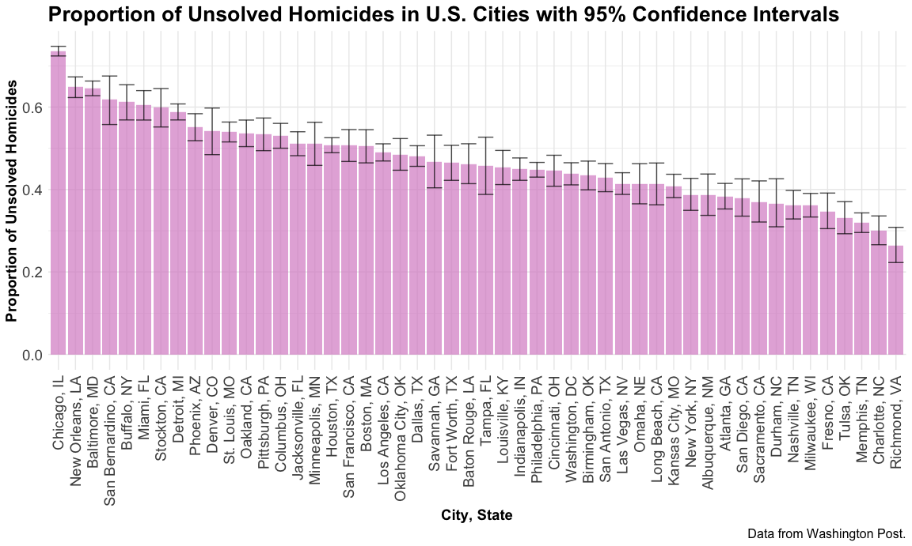

p8105_hw5_amz2148
================

Data Science: Homework 5

# Problem 0

``` r
library(tidyverse) #loads tidyverse package
```

    ## ── Attaching packages ─────────────────────────────────────── tidyverse 1.3.2 ──
    ## ✔ ggplot2 3.3.6      ✔ purrr   0.3.5 
    ## ✔ tibble  3.1.8      ✔ dplyr   1.0.10
    ## ✔ tidyr   1.2.0      ✔ stringr 1.4.1 
    ## ✔ readr   2.1.3      ✔ forcats 0.5.2 
    ## ── Conflicts ────────────────────────────────────────── tidyverse_conflicts() ──
    ## ✖ dplyr::filter() masks stats::filter()
    ## ✖ dplyr::lag()    masks stats::lag()

``` r
library(purrr) #loads tidyverse package
set.seed(1)
```

``` r
knitr::opts_chunk$set(echo = TRUE) #shows all code chunks
knitr::opts_chunk$set(
  fig.width = 12,
  fig.asp = .6,
  out.width = "100%") #sets figure dimensions

theme_set(theme_minimal() + theme(legend.position = "bottom")) #sets default figure theme
```

# Problem 1

# Problem 2

First, we load the CSV file of homicide data from Washington Past, clean
the variable names, and change unknown values to NA for consistency
(since some but not all variables already have missing/unknown values
already coded as NA).

``` r
homicides = 
  read_csv("data/homicide_data.csv") %>% #loads csv file
  janitor::clean_names() %>% #cleans variable names
  gdata::unknownToNA("Unknown", warning = FALSE) #changes all "unknown" values to "NA"
```

    ## Rows: 52179 Columns: 12
    ## ── Column specification ────────────────────────────────────────────────────────
    ## Delimiter: ","
    ## chr (9): uid, victim_last, victim_first, victim_race, victim_age, victim_sex...
    ## dbl (3): reported_date, lat, lon
    ## 
    ## ℹ Use `spec()` to retrieve the full column specification for this data.
    ## ℹ Specify the column types or set `show_col_types = FALSE` to quiet this message.

In the resulting dataset, there are `52179` rows (observations) and `12`
columns (variables). The variables’ names are
`uid, reported_date, victim_last, victim_first, victim_race, victim_age, victim_sex, city, state, lat, lon, disposition`.
We can see `uid` provides the victim’s ID (with a prefix for the city
proceeding a number), `reported_date` gives the date on which the
homicide was reported (YYYYMMDD), `victim_last` gives the victim’s last
name, `victim_first` gives the victim’s first name, `victim_race` gives
the victim’s race (Asian, Black, Hispanic, Other, White), `victim_age`
gives the victim’s age in years, `victim_sex` gives the victim’s sex
(male, female), `city`, `state`, `lat` (latitude), and `long`
(longitude) give the location of the homicide, and `disposition` gives
the outcome of the case (closed by arrest, closed without arrest,
open/no arrest).

Next, we create a city_state variable (e.g. “Baltimore, MD”) and then
summarize within cities to obtain the total number of homicides and the
number of unsolved homicides (those for which the disposition is “Closed
without arrest” or “Open/No arrest”). The table showing this data is
outputted below the associated code.

``` r
homicides = 
  homicides %>% 
  mutate(state = replace(state, state == "AL", "OK")) %>% 
  mutate(state = replace(state, state == "wI", "WI")) %>% 
  mutate(city_state = paste(city, state, sep = ", ")) %>% #creates city_state variable
  group_by(city_state) %>% #groups by city_state
  summarize(n_unsolved = sum(disposition == 'Closed without arrest' | disposition == 'Open/No arrest'), n_total = n()) #creates new variables for total homicides and total unsolved homicides

homicides_table = 
  homicides %>% 
  knitr::kable(digits = 4) #creates table

homicides_table #outputs table
```

| city_state         | n_unsolved | n_total |
|:-------------------|-----------:|--------:|
| Albuquerque, NM    |        146 |     378 |
| Atlanta, GA        |        373 |     973 |
| Baltimore, MD      |       1825 |    2827 |
| Baton Rouge, LA    |        196 |     424 |
| Birmingham, OK     |        347 |     800 |
| Boston, MA         |        310 |     614 |
| Buffalo, NY        |        319 |     521 |
| Charlotte, NC      |        206 |     687 |
| Chicago, IL        |       4073 |    5535 |
| Cincinnati, OH     |        309 |     694 |
| Columbus, OH       |        575 |    1084 |
| Dallas, TX         |        754 |    1567 |
| Denver, CO         |        169 |     312 |
| Detroit, MI        |       1482 |    2519 |
| Durham, NC         |        101 |     276 |
| Fort Worth, TX     |        255 |     549 |
| Fresno, CA         |        169 |     487 |
| Houston, TX        |       1493 |    2942 |
| Indianapolis, IN   |        594 |    1322 |
| Jacksonville, FL   |        597 |    1168 |
| Kansas City, MO    |        486 |    1190 |
| Las Vegas, NV      |        572 |    1381 |
| Long Beach, CA     |        156 |     378 |
| Los Angeles, CA    |       1106 |    2257 |
| Louisville, KY     |        261 |     576 |
| Memphis, TN        |        483 |    1514 |
| Miami, FL          |        450 |     744 |
| Milwaukee, WI      |        403 |    1115 |
| Minneapolis, MN    |        187 |     366 |
| Nashville, TN      |        278 |     767 |
| New Orleans, LA    |        930 |    1434 |
| New York, NY       |        243 |     627 |
| Oakland, CA        |        508 |     947 |
| Oklahoma City, OK  |        326 |     672 |
| Omaha, NE          |        169 |     409 |
| Philadelphia, PA   |       1360 |    3037 |
| Phoenix, AZ        |        504 |     914 |
| Pittsburgh, PA     |        337 |     631 |
| Richmond, VA       |        113 |     429 |
| Sacramento, CA     |        139 |     376 |
| San Antonio, TX    |        357 |     833 |
| San Bernardino, CA |        170 |     275 |
| San Diego, CA      |        175 |     461 |
| San Francisco, CA  |        336 |     663 |
| Savannah, GA       |        115 |     246 |
| St. Louis, MO      |        905 |    1677 |
| Stockton, CA       |        266 |     444 |
| Tampa, FL          |         95 |     208 |
| Tulsa, OK          |        193 |     584 |
| Washington, DC     |        589 |    1345 |

For the city of Baltimore, MD, we use the `prop.test` function to
estimate the proportion of homicides that are unsolved; save the output
of `prop.test` as an R object, apply the `broom::tidy` to this object
and pull the estimated proportion and confidence intervals from the
resulting tidy dataframe.

``` r
baltimore_md = 
  homicides %>% 
  filter(city_state == "Baltimore, MD")

x = baltimore_md %>% pull(n_unsolved)
n = baltimore_md %>% pull(n_total)

baltimore_test = 
  prop.test(x, n, p = NULL, 
          alternative = c("two.sided", "less", "greater"), 
          conf.level = 0.95, correct = TRUE) %>% 
  broom::tidy() %>% 
  janitor::clean_names()

baltimore_table = 
  baltimore_test %>% 
  select(estimate, starts_with("conf")) %>% 
  knitr::kable(digits = 4) #creates table

baltimore_table
```

| estimate | conf_low | conf_high |
|---------:|---------:|----------:|
|   0.6456 |   0.6276 |    0.6632 |

Now run prop.test for each of the cities in your dataset, and extract
both the proportion of unsolved homicides and the confidence interval
for each. Do this within a “tidy” pipeline, making use of purrr::map,
purrr::map2, list columns and unnest as necessary to create a tidy
dataframe with estimated proportions and CIs for each city.

``` r
all_cities = 
  homicides %>%
  mutate(test = map2(n_unsolved, n_total, ~ prop.test(.x, .y, conf.level=0.95) %>% 
  broom::tidy())) %>% 
  unnest(test) %>% 
  janitor::clean_names() %>% 
  select(city_state, estimate, conf_low, conf_high) %>% 
  mutate(city_state = as.factor(city_state))

all_cities_table = 
  all_cities %>%
  knitr::kable(digits = 4) #creates table

all_cities_table
```

| city_state         | estimate | conf_low | conf_high |
|:-------------------|---------:|---------:|----------:|
| Albuquerque, NM    |   0.3862 |   0.3373 |    0.4376 |
| Atlanta, GA        |   0.3834 |   0.3528 |    0.4148 |
| Baltimore, MD      |   0.6456 |   0.6276 |    0.6632 |
| Baton Rouge, LA    |   0.4623 |   0.4142 |    0.5110 |
| Birmingham, OK     |   0.4338 |   0.3992 |    0.4690 |
| Boston, MA         |   0.5049 |   0.4646 |    0.5451 |
| Buffalo, NY        |   0.6123 |   0.5688 |    0.6541 |
| Charlotte, NC      |   0.2999 |   0.2661 |    0.3359 |
| Chicago, IL        |   0.7359 |   0.7240 |    0.7474 |
| Cincinnati, OH     |   0.4452 |   0.4080 |    0.4831 |
| Columbus, OH       |   0.5304 |   0.5002 |    0.5605 |
| Dallas, TX         |   0.4812 |   0.4562 |    0.5062 |
| Denver, CO         |   0.5417 |   0.4846 |    0.5977 |
| Detroit, MI        |   0.5883 |   0.5688 |    0.6076 |
| Durham, NC         |   0.3659 |   0.3096 |    0.4261 |
| Fort Worth, TX     |   0.4645 |   0.4223 |    0.5072 |
| Fresno, CA         |   0.3470 |   0.3051 |    0.3914 |
| Houston, TX        |   0.5075 |   0.4892 |    0.5257 |
| Indianapolis, IN   |   0.4493 |   0.4223 |    0.4766 |
| Jacksonville, FL   |   0.5111 |   0.4820 |    0.5401 |
| Kansas City, MO    |   0.4084 |   0.3804 |    0.4370 |
| Las Vegas, NV      |   0.4142 |   0.3881 |    0.4407 |
| Long Beach, CA     |   0.4127 |   0.3629 |    0.4643 |
| Los Angeles, CA    |   0.4900 |   0.4692 |    0.5109 |
| Louisville, KY     |   0.4531 |   0.4121 |    0.4948 |
| Memphis, TN        |   0.3190 |   0.2957 |    0.3433 |
| Miami, FL          |   0.6048 |   0.5686 |    0.6400 |
| Milwaukee, WI      |   0.3614 |   0.3333 |    0.3905 |
| Minneapolis, MN    |   0.5109 |   0.4585 |    0.5631 |
| Nashville, TN      |   0.3625 |   0.3286 |    0.3977 |
| New Orleans, LA    |   0.6485 |   0.6231 |    0.6732 |
| New York, NY       |   0.3876 |   0.3494 |    0.4271 |
| Oakland, CA        |   0.5364 |   0.5041 |    0.5685 |
| Oklahoma City, OK  |   0.4851 |   0.4468 |    0.5236 |
| Omaha, NE          |   0.4132 |   0.3653 |    0.4627 |
| Philadelphia, PA   |   0.4478 |   0.4300 |    0.4657 |
| Phoenix, AZ        |   0.5514 |   0.5185 |    0.5839 |
| Pittsburgh, PA     |   0.5341 |   0.4943 |    0.5735 |
| Richmond, VA       |   0.2634 |   0.2229 |    0.3083 |
| Sacramento, CA     |   0.3697 |   0.3212 |    0.4209 |
| San Antonio, TX    |   0.4286 |   0.3948 |    0.4630 |
| San Bernardino, CA |   0.6182 |   0.5577 |    0.6753 |
| San Diego, CA      |   0.3796 |   0.3354 |    0.4258 |
| San Francisco, CA  |   0.5068 |   0.4681 |    0.5454 |
| Savannah, GA       |   0.4675 |   0.4041 |    0.5319 |
| St. Louis, MO      |   0.5397 |   0.5154 |    0.5637 |
| Stockton, CA       |   0.5991 |   0.5517 |    0.6447 |
| Tampa, FL          |   0.4567 |   0.3881 |    0.5270 |
| Tulsa, OK          |   0.3305 |   0.2927 |    0.3705 |
| Washington, DC     |   0.4379 |   0.4112 |    0.4649 |

Finally, we create a plot that shows the estimates and CIs for each
city, adding error bars based on the upper and lower limits. We organize
cities according to the proportion of unsolved homicides.

``` r
all_cities = 
  all_cities %>%
  mutate(city_state = reorder(city_state, -estimate))

ggplot(all_cities, aes( x = city_state, y = estimate)) + 
  geom_bar(stat = 'identity', alpha = 0.7, fill = "#d98fcc") + 
  geom_errorbar(aes(ymin = conf_low, ymax = conf_high), alpha = 0.7) + 
  theme(plot.title = element_text(size = 20, face = "bold")) +
  theme(axis.text.x = element_text(angle = 90, vjust = 0.5, hjust = 1, size = 14)) + 
  theme(axis.text.y = element_text(size = 14)) + 
  theme(axis.title = element_text(size = 14, face = "bold")) + 
  theme(plot.caption = element_text(size = 12)) + 
  labs(
      title = "Proportion of Unsolved Homicides in U.S. Cities with 95% Confidence Intervals",
      x = "City, State",
      y = "Proportion of Unsolved Homicides",
      caption = "Data from Washington Post.")
```



# Problem 3

In this problem, we will conduct a simulation to explore power in a
one-sample t-test. First, we set the following design elements:

-   Fix n=30
-   Fix σ=5
-   Set μ=0. Generate 5000 datasets from the model x∼Normal\[μ,σ\]

For each dataset, we save mu hat and the p-value arising from a test of
H: mu = 0 and alpha = 0.05. To obtain the estimate and p-value, we use
`broom::tidy` to clean the output of `t.test`.

``` r
sim_t_test = function(sample_size=30, mu, sigma = 5){

sample = rnorm(n = sample_size, mean = 0, sd = sigma)

test_results = t.test(sample)

test_results %>% 
  broom::tidy()
}

sim_results_df = 
  expand_grid(
    sample_size = c(30),
    iter = 1:100
  ) %>% 
  mutate(
    estimate_df = map(sample_size, sim_t_test)
  ) %>% 
  unnest(estimate_df)
```

``` r
sim_t_test = function(mean, n = 30, sd = 5){

sample = rnorm(mean, n = 30, sd = 5)

test_results = t.test(sample)

test_results %>% 
  broom::tidy()
}

sim_results_df = 
  expand_grid(
    true_mean = c(1, 2, 3, 4, 5, 6),
    iter = 1:100
  ) %>% 
  mutate(
    estimate_df = map(true_mean, sim_t_test)
  ) %>% 
  unnest(estimate_df)
```
